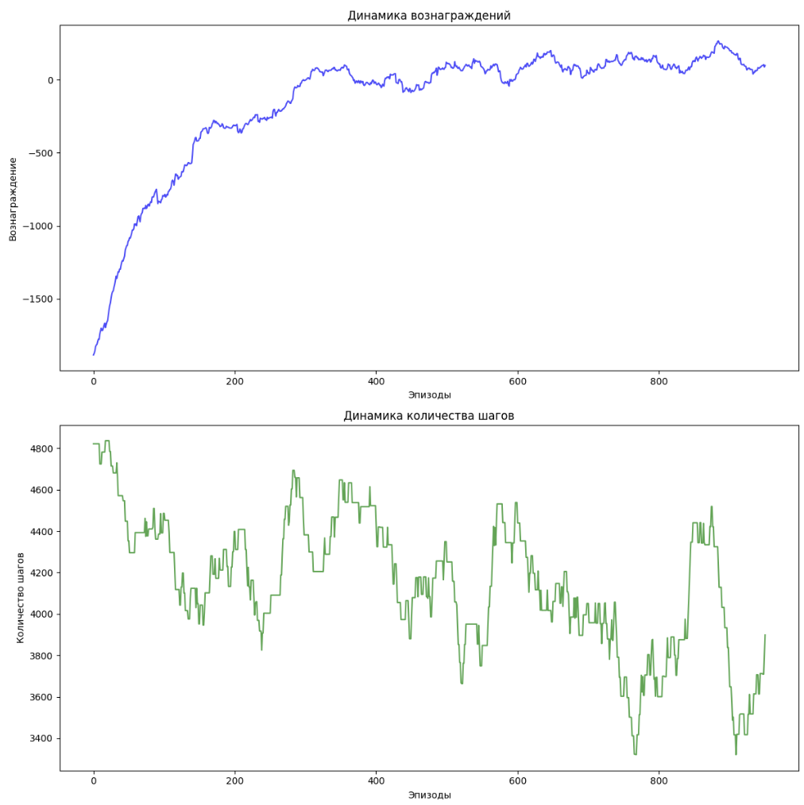

# Q-Learning Агент для задачи с переливанием жидкости между стаканами

Этот проект реализует агента с использованием алгоритма Q-learning, который обучается балансировать объем жидкости в нескольких стаканах через переливания между ними. Цель агента — привести объем жидкости в каждом стакане к среднему целевому значению, используя Q-learning — популярный алгоритм обучения с подкреплением.

## Описание

Среда состоит из 5 стаканов с максимальной емкостью 10 единиц жидкости в каждом. Задача агента — делать переливания между стаканами, чтобы достичь состояния, в котором объем жидкости в каждом стакане как можно больше приближен к среднему значению.

Агент обучается методом проб и ошибок с использованием алгоритма Q-learning, который обновляет Q-таблицу для выбора оптимальных действий. Состояние системы — это текущий объем жидкости в каждом стакане, а действия — это переливание жидкости между любыми двумя стаканами. Функция вознаграждения побуждает агента уменьшать разницу между текущим состоянием и целевым.

## Основные компоненты

1. **Представление состояния**:  
   Состояние представлено массивом целых чисел, где каждое значение соответствует количеству жидкости в соответствующем стакане.

2. **Представление действий**:  
   Действие представляет собой переливание жидкости между двумя стаканами. Все возможные действия представлены списком пар индексов, где каждая пара (from_idx, to_idx) указывает на стаканы, между которыми происходит переливание.

3. **Функция вознаграждения**:  
   Агент получает вознаграждение в зависимости от того, насколько близким является состояние к целевому (состоянию, где в каждом стакане одинаковый объем жидкости). Когда все стаканы содержат одинаковое количество жидкости, агент получает вознаграждение 10. Агент получает штраф, если его действия приводят к удалению от целевого состояния.

4. **Алгоритм Q-learning**:  
   Q-значения обновляются по стандартной формуле Q-learning, где агент выбирает действия на основе ε-жадной стратегии (исследование против использования накопленного опыта). Q-значения помогают агенту выбирать оптимальные действия с течением времени.

## Особенности

- **Исследование против использования опыта**:  
   Агент начинает с высокой вероятностью случайных действий (исследование), постепенно уменьшая её, чтобы использовать выученные стратегии (эксплуатация).
  
- **Коэффициент обучения**:  
   Агент обновляет свои знания с определенной скоростью, регулируемой коэффициентом обучения.

- **Динамика обучения**:  
   Графики показывают изменения вознаграждения и количества шагов, которые агент предпринимает в процессе обучения, что позволяет наблюдать прогресс.

## Как работает код

1. **Инициализация параметров**:  
   Количество стаканов (5) и максимальная емкость каждого стакана (10) задаются в начале. Агент должен перераспределять жидкость между стаканами, стремясь привести их объемы к целевому.

2. **Функция создания случайного состояния**:  
   Генерируется начальное состояние стаканов, где количество жидкости в каждом стакане случайным образом выбирается в пределах от 0 до 10.

3. **Функция расчета целевого объема**:  
   Целевой объем для каждого стакана — это среднее значение объема жидкости во всех стаканах. Агент должен стремиться привести каждый стакан к этому значению.

4. **Функция возможных действий**:  
   Создается список всех возможных переливаний жидкости между стаканами. Агент может переливать жидкость из одного стакана в другой.

5. **Переливание жидкости**:  
   Функция `perform_transfer` отвечает за выполнение действия — переливания жидкости между двумя стаканами, с учетом их текущих объемов и максимальной емкости.

6. **Обновление Q-таблицы**:  
   Агент обновляет свои знания в Q-таблице на основе опыта. Если он предпринимает удачные шаги, его действия получают высокие значения Q, что повышает вероятность их повторения в будущем.

7. **Обучение агента**:  
   Агент обучается на протяжении заданного числа эпизодов (1000 по умолчанию), в каждом из которых он делает серии переливаний, стремясь минимизировать разницу между состоянием и целевым объемом. В процессе обучения уменьшается вероятность случайных действий, а также коэффициент обучения.
   
   


## Запуск обучения

Чтобы начать обучение, нужно создать экземпляр агента и вызвать метод `train_agent`, который будет запускать цикл обучения.

```python
# Запуск обучения
agent = QLearningAgent(exploration_rate=0.5, learning_rate=0.5)
agent.train_agent(total_episodes=1000)
```

## Результаты обучения

После завершения обучения агент будет выводить:

1. **Вознаграждения**: График динамики вознаграждений в процессе обучения.
2. **Количество шагов**: График изменения количества шагов, которые агент предпринимает для достижения цели.
   
3. **Среднее количество шагов**: Среднее количество шагов для первых и последних 100 эпизодов, что позволяет оценить прогресс агента.
   

## Установка и запуск

1. Убедитесь, что у вас установлены библиотеки:
   - `numpy`
   - `random`
   - `matplotlib`

2. Скачайте или клонируйте этот репозиторий.

3. Запустите файл с кодом. Он автоматически выполнит обучение агента и покажет графики, демонстрирующие его прогресс.

## Заключение

Этот проект демонстрирует применение алгоритма Q-learning для решения задачи перераспределения жидкости между стаканами. В процессе обучения агент улучшает свои решения и находит оптимальные действия для достижения целевого состояния.# Q-Learning-
